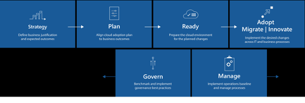

# AKS Adoption Aligned to Cloud Adoption Framework

This document is designed to review adoption of AKS that is aligned to the Cloud Adoption Framework.

# Table of Contents

- [AKS Adoption Aligned to Cloud Adoption Framework](#aks-adoption-aligned-to-cloud-adoption-framework)
- [Table of Contents](#table-of-contents)
- [Introduction](#introduction)
- [Establishing Strategy](#establishing-strategy)
  - [Understanding Business Motivations](#understanding-business-motivations)
  - [AKS Business Outcomes](#aks-business-outcomes)
  - [AKS Business Justification](#aks-business-justification)
  - [Faster Time to Market](#faster-time-to-market)
  - [Optimized IT Costs](#optimized-it-costs)
  - [Improved Scalability & Availability](#improved-scalability--availability)
  - [Multi-Cloud Flexibility](#multi-cloud-flexibility)
  - [Seamless Cloud Migration](#seamless-cloud-migration)
- [Plan](#plan)
  - [AKS Adoption Steps](#aks-adoption-steps)
    - [Networking](#networking)
      - [Azure Virtual Networks](#azure-virtual-networks)
      - [Ingress Controllers](#ingress-controllers)
      - [Network Security Groups](#network-security-groups)
      - [Network Policy](#network-policy)
    - [Storage](#storage)
      - [Azure Disks](#azure-disks)
      - [Azure Files](#azure-files)
    - [Security](#security)
    - [Scaling](#scaling)
  - [Digital Estate](#digital-estate)
    - [Application Assessment](#application-assessment)
      - [Monolithic Architecture](#monolithic-architecture)
      - [Microservices Architecture](#microservices-architecture)
      - [Microservices vs. Monolithic](#microservices-vs-monolithic)
  - [Accelerated Application Development](#accelerated-application-development)
  - [Supports Agile Project Management](#supports-agile-project-management)
  - [Enable Security and Compliance](#enable-security-and-compliance)
    - [Safeguard the Cluster](#safeguard-the-cluster)
    - [Enable Kubernetes RBAC](#enable-kubernetes-rbac)
    - [Enable API Server Firewall](#enable-api-server-firewall)
    - [Block Pod Access to Host/VM Instance Metadata](#block-pod-access-to-hostvm-instance-metadata)
    - [Increase Node Security](#increase-node-security)
    - [Limit Node SSH Access](#limit-node-ssh-access)
    - [Firewall Ingress to Apps](#firewall-ingress-to-apps)
    - [Deploy Service Mesh](#deploy-service-mesh)
    - [Pod Security Policy (PSP)](#pod-security-policy-psp)
  - [Resources on Demand](#resources-on-demand)
    - [Auto Scaling](#auto-scaling)
    - [Horizontal Pod Autoscaler (HPA)](#horizontal-pod-autoscaler-hpa)
    - [Cluster Autoscaler (CA)](#cluster-autoscaler-ca)
    - [On-Demand Fast Scaling](#on-demand-fast-scaling)
  - [Availability & Costs](#availability--costs)
  - [Speed & Agility of Innovation Drives Customer Experience](#speed--agility-of-innovation-drives-customer-experience)
  - [Enabling Digital Transformation Using Containers](#enabling-digital-transformation-using-containers)
  - [AKS Adoption Plan](#aks-adoption-plan)
  - [Skill Readiness Plan](#skill-readiness-plan)
    - [Gap Plan](#gap-plan)
- [Ready](#ready)
  - [Organize](#organize)
  - [Resources](#resources)
- [Adopt](#adopt)
  - [Migrate](#migrate)
  - [Innovate](#innovate)
- [Govern](#govern)
  - [Automation of AKS deployments:](#automation-of-aks-deployments)
- [Manage](#manage)
- [AKS Migration Best Practices](#aks-migration-best-practices)
  - [Groups of Users / Personas](#groups-of-users--personas)
  - [Licensing and Entitlements](#licensing-and-entitlements)
  - [Pricing](#pricing)
  - [Business Continuity and Disaster Recovery](#business-continuity-and-disaster-recovery)

# Introduction

Let's start by understanding what Cloud Adoption Framework is. Cloud
Adoption Framework is a collection of documentation, implementation
guidance, best practices, and tools that are proven guidance from
Microsoft designed to accelerate your cloud adoption journey. Below
diagram shows the different phases of Cloud Adoption Framework Journey.
In this document we explain what needs to happen for AKS deployment and
management in each phase of the cloud adoption framework.

# Establishing Strategy 

Business transformations can be implemented with the help of the AKS
Strategy. The current section defines the business agility, market
demands, and various rationalizing factors associated with the adoption
of the AKS that would enable business to evolve. The documentation
facilitates the stakeholders in understanding the benefits that result
from utilizing the AKS Adoption Framework. The rationalizing factors
that would be discussed in this section are:

-   Understanding Business Motivations
-   AKS Business Outcomes
-   AKS Business Justification
-   Faster Time to Market
-   Optimized IT Costs
-   Improved Scalability and Availability
-   Multi cloud Flexibility
-   Seamless Cloud Migration

## Understanding Business Motivations

Outlining the outcomes of a business is critical as they enable in
defining a versatile strategy. This would empower the business to be
scaled accordingly, while affecting the performance as well.
Stakeholders are required to be a part in establishing the appropriate
business outcomes. Business motivations for AKS adoption are classified
into the following categories.

| Critical business events | Migration | Innovation |
| :----------------| ---------- | :----------- |
| Datacenter Consolidation | Cost saving | Equipping for latest technical capabilities|
|Merger, acquisition, or divestiture | Reduction in vendor or technical complexity | Developing technical offerings |
|Reduction in capital expenses | Optimization of internal operations | Scaling to accommodate the ever-growing requirements |
|End of support for mission-critical technologies | Increase in business agility | Transforming to cater to geographic needs |
|Response to regulatory compliance changes | Preparation for new technical capabilities | Improved customer experiences and engagements | 
|New data sovereignty requirements | Evolving to cater market demands | Transformation of products or services | 
|Reduction of disruptions and improvement of IT stability | Scaling to meet geographic demands | Create market disruption with innovative products/services |

Reasons to adapt to AKS are as following:

-   Adopting industry standard cloud native technologies
-   Enables granular control and monitoring
-   Offers flexibility of auto-scaling
-   Easy flexible networking like public IPs, DNS, and SS
-   Facilitates multiple multi-container deployments
-   Implementing a multi-cloud strategy
-   Improving the density of workloads within the infrastructure
-   Easier to recruit engineering talent from industry by adopting modern technologies

## AKS Business Outcomes

Designing a comprehensive AKS adoption strategy is essential in order to
evaluate the business motivations and examine the likely future
outcomes.

The classification of business outcomes varies in five different
categories. It is important for anticipated business outcomes to be
ranked according to priority: from high, to mid, to low priority. Make
sure to include stakeholders and the business drivers behind a specific
outcome, associate what KPIs and capabilities are required in order to
achieve the desired outcome. The following categories are used to
identify and segregate desired business outcomes

-   **Infrastructure:** End to end cloud native architecture
-   **Consistency:** Uniform architecture across multiple cloud platform
-   **Technology**: Higher density of workloads within infrastructure leading to reduction of cost
-   **Agility:** Time-to-Market and provision time to respond to changes
-   **Reach:** Global access and data sovereignty
-   **Workforce Engagement:** Improved customer experience
-   **Fiscal**: Cost savings on desktop computing, increase revenue and drive profits
-   **Performance:** Ensuring highly availability of business applications
-   **Security & Compliance Regulations:** Addressed and implemented.

## AKS Business Justification

Here are five fundamental business capabilities that AKS can drive in an
enterprise

## Faster Time to Market

AKS enables a "microservices" approach to building apps. Now development
team can be broken into smaller teams that focus on a single, smaller
microservice. These teams are smaller and more agile because each team
has a focused function. APIs between these microservices minimize the
amount of cross-team communication required to build and deploy. So,
ultimately, multiple small teams can be scaled up of specialized experts
who each help support a fleet of thousands of machines.

Kubernetes also allows IT teams to manage large applications across many
containers more efficiently by handling many of the nitty-gritty details
of maintaining the container-based apps. For example, Kubernetes handles
service discovery, helps containers talk to each other, and arranges
access to storage from various providers such as AWS, Microsoft Azure.

## Optimized IT Costs

AKS can help the business, cut infrastructure costs quite drastically if
operating at a massive scale. Kubernetes makes a container-based
architecture feasible by packing together apps optimally using cloud and
hardware investments. Before Kubernetes, administrators often
over-provisioned their infrastructure to conservatively handle
unexpected spikes, or simply because it was difficult and time consuming
to manually scale containerized applications. Kubernetes intelligently
schedules and tightly packs containers, considering the available
resources. It also automatically scales the application to meet business
needs, thus freeing up human resources to focus on other productive
tasks.

There are many examples of customers who have seen dramatic improvements
in cost optimization using K8s.

## Improved Scalability & Availability

The success of today's applications does not depend only on features,
but also on the scalability of the application. After all, if an
application cannot scale well, it will be highly non-performant at its
best, and totally unavailable, at the worst case.

As an orchestration system, AKS is a critical management system to
"auto-magically" scale and improve app performance. Suppose there is a
service which is CPU-intensive and with dynamic user load that changes
based on business conditions (for example, an event ticketing app that
will see dramatic users and loads prior to the event and low usage at
other times). In the instance there is a need for a solution that can
scale up the app and its infrastructure so that new machines are
automatically spawned up as the load increases (more users are buying
tickets), while scaling it down when the load subsides. AKS offers just
that capability by scaling up the application as the CPU usage goes
above a defined threshold which for example, is 90 percent on the
current machine, then it is automatically scaled up. And when the load
reduces, AKS can scale back the application, thus optimizing the
infrastructure utilization. The AKS auto-scaling is not limited to just
infrastructure metrics; any type of metric\--resource utilization
metrics - even custom metrics can be used to trigger the scaling
process.

## Multi-Cloud Flexibility

One of the biggest benefits of AKS managed containers is that it helps
in realizing the promise of hybrid and multi-cloud. Enterprises today
are already running multi-cloud environments and will continue to do so
in the future. Kubernetes makes it much easier is to run any app on any
public cloud service or any combination of public and private clouds.

This allows to put the right workloads on the appropriate cloud and
helps avoid vendor lock-in. Getting the best fit, using the right
features, and having the leverage to migrate when it makes sense, all
help to realize more ROI (short and longer term) from the IT
investments.

## Seamless Cloud Migration

Whether a client is rehosting (lift and shift of the app),
replat-forming (make some basic changes to the way it runs), or
refactoring (the entire app and the services that support it are
modified to better suit the new compartmentalized environment), AKS
makes sure the aspects are covered.

Since Kubernetes runs consistently across all environments, on-premise
and public cloud, Kubernetes provides a more seamless and prescriptive
path to port the application from on-premise to cloud environments.
Rather than deal with all the variations and complexities of the cloud
environment, enterprises can follow a more prescribed path:

-   **Migrate apps to Kubernetes on-premise** Here focus is more on replat-forming the apps to containers and bringing them under Kubernetes orchestration.

-   **Move to a cloud-based Kubernetes instance.** Many options are available here: Run Kubernetes natively or choose a managed Kubernetes environment from the cloud vendor.

-   Now that the application is in the cloud, **optimizing the application to the cloud environment and its services** can be started 

# Plan 

## AKS Adoption Steps

Here provision can be made to configure the AKS that will support
workloads.

Evaluating and determining the best approach to containerizing the
digital assets using AKS. After determining an approach and aggregated
an inventory, rationalization can begin. As a part of the planning
exercise the following factors are needed to be taken into
consideration:

-   Networking
-   Storage
-   Security
-   Scaling

In the below given sections of the document the various aspects are
discussed in detail.

### Networking

In the AKS approach to the application development, components must work
together to process their tasks. The various vital factors to be studied
are as follows:

#### Azure Virtual Networks

In the container based micro services, a cluster can be deployed by
employing one of the below given network models.

- [Kubenet](https://kubernetes.io/docs/concepts/cluster-administration/network-plugins/#kubenet) networking: The network resources are created and configured while AKS cluster is deployed

-  [Azure Container Networking Interface (CNI)](https://github.com/Azure/azure-container-networking/blob/master/docs/cni.md)
 networking: The AKS cluster is linked to the already existing
 virtual network resources and configurations

The choice of which network plugin to use for AKS cluster is a balance
between flexibility and advanced configuration needs. The following
considerations helps outline which network model may be well suited.

- **Kubernetes**
  -   Conserves IP address space
  -   Uses Kubernetes internal or external load balancer to reach pods
 from outside of the cluster
  -   User-defined routes (UDRs) must be manually managed and maintained
  -   Maximum of 400 nodes per cluster

- **Azure CNI**
  -   Pods get full virtual network connectivity and can be directly
 reached via their private IP address from connected networks
  -   Requires more IP address space

#### Ingress Controllers

An ingress controller is a piece of software that provides reverse
proxy, configurable traffic routing, and TLS termination for Kubernetes
services. Using an ingress controller and ingress rules, a single IP
address can be used to route traffic to multiple services in a
Kubernetes cluster.

The different features that makes the Ingress controller a wise pick is
given below:

-   In AKS, an Ingress resource can be created using something like
 NGINX, or use the AKS HTTP application routing feature. For more
 information, refer to the [deploy HTTP application
 routing](https://docs.microsoft.com/bs-latn-ba/azure/aks/http-application-routing)
-   Another common feature of Ingress is SSL/TLS termination. In order
 to configuring an Ingress controller, check the [Ingress and
 TLS](https://docs.microsoft.com/bs-latn-ba/azure/aks/ingress)
-   AGIC which is another option, aids in eliminating the need to have
 another load balancer/public IP in front of the AKS cluster, while
 preventing the multiple hops in the data path. Check the given
 [link](https://github.com/faridabharmal/AKS_CAF_SolutionFactory/blob/master/TechnicalEnablement/CAF-Application%20Gateway%20Ingress%20Controller.docx?raw=true)
 for more details:

#### Network Security Groups

The Azure network security group can be employed to filter network
traffic to and from Azure resources in an Azure virtual network.

The various uses of the Network security groups are mentioned below that
help in evaluating the traffic by priority:

-   The network security group segregates the traffic for VMs, such as
 the AKS nodes

-   As the Services like a LoadBalancer are established, the Azure
 platform automatically configures any network security group rules
 that are needed

-   Any required ports can be defined and forwarded as a part of the
 Kubernetes Service manifests, while allowing the Azure platform
 create or update the appropriate rules

#### Network Policy

Network Policy is a Kubernetes specification that defines access
policies for communication between Pods. The Azure Network Policy
implementation supports the standard Kubernetes Network Policy
specification. To know more about the network policies, view
the [Kubernetes
documentation](https://kubernetes.io/docs/concepts/services-networking/network-policies/).

To improve security, rules or the network policies can be defined to
control the flow of traffic.

Network policies can be included as part of a wider manifest (e.g, YAML)
that also creates a deployment or service.

There are few network policy options that can be implemented while
defining an AKS cluster that Azure allows, which help in establishing a
secure network. The policy option cannot be changed after the cluster is
created.

-   Azure\'s own implementation, called Azure Network Policies

-   Calico Network Policies, an open-source network and network security
 solution founded by [Tigera](https://www.tigera.io/)

### Storage

Persistent storage plays a vital role in micro services architecture in
which data must be decoupled from the pod lifecycle. AKS supports
multiple options for configuring persistent storage including Azure
Disks, Azure Files, and Azure NetApp Files. The various properties and
features are given in the following sections.

#### Azure Disks

Persistent volumes for pods in AKS can be created with Azure Disks,
which uses Azure premium or standard storage. The following
considerations helps outline which storage model is ideal for the
deployment:

-   Premium storage provides performance levels at the same level as
 SSDs, and standard storage provides HDD-level performance

-   While the former is ideal for production workloads with higher IOPS
 requirements, while HDD storage is more suited for test and
 development environments

-   Persistent volumes created from Azure Disks can, however, be mounted
 to just one pod at a time and do not support use cases that
 require shared storage

#### Azure Files

Azure Files is a managed file share service for creating SMB and NFS
file shares accessible to workloads hosted on-premises or in Azure. The
various features that help in evaluating the storage needs as per the
requirements are stated below:

-   The service can be used to create persistent volumes for pods
 deployed in AKS clusters

-   The Azure Files also support SSD and HDD capabilities through
 premium and standard storage options. AKS cluster versions,
 however, must be higher than 1.13 in order to use premium storage

-   Storage volumes created from Azure Files can be accessed
 simultaneously from multiple pods in the cluster

### Security

Security operations maintain the assurances of the system as adversaries
attack it. The different features that facilitate a secure system are
given as follows:

-   AKS integrates with Active Directory to manage AKS cluster access

-   The service principal configured is integrated with AD to delegate
 access to other Azure resources

-   The role-based access control in the cluster is enabled in ordered
 to provide granular access to cluster resources that help develop
 a safe system

### Scaling 

Scaling is one way to maximize the benefits. Azure Kubernetes service
includes node CPU and memory monitoring at no additional cost. At the
cluster creation, the container monitoring can be enabled. The various
features that need to be examined while scaling the ecosystem are given
below:

-   The [container
 monitoring](https://docs.microsoft.com/en-us/azure/azure-monitor/insights/container-insights-overview) sends
 additional metrics and logs using Log Analytics, which has fees
 based on the amount of data ingested. Simply enable container
 monitoring and then select or create a log analytics workspace to
 store the AKS data.

-   CPU and memory usage per node, controller, or the pod usage can be
 controlled with the container monitoring enabled. The metrics can
 be viewed with the Azure Monitor that is not available, unless
 authorized.

-   A Prometheus integration with container insights helps close the gap
 on monitoring for many use cases, while the system is scaled
 accordingly.

## Digital Estate 

Based on the requirement of the digital estate, a plan need to be
constructed. The digital estate is an abstract reference to a collection
of tangible owned assets such as - VMs, servers, applications, data,
etc. In other words, a digital estate is the collection of IT assets
that power the business processes and supporting operations. From the
AKS perspective, it is important to know the applications and workloads
that are desired to be used in the cloud in which case environment as
well as the applications need to be assessed.

-   Decision tree need to be created, on what applications are going to
 be moved to AKS. The decision tree is explained in detail in the
 [given link](https://github.com/faridabharmal/AKS_CAF_SolutionFactory/blob/master/TechnicalEnablement/AKS_Decision%20Tree.docx).

-   Questions that the business need to ask themselves regarding their
 data and applications in order to get the best possible start to a
 new AKS project?

### Application Assessment

Application assessments provides the current performance and usage
details like OS, CPU, etc., by classifying users into Personas (task
workers, power users, knowledge worker etc.), the applications, the
various workloads accessed by the users and related, and Azure costs
involved.

It is important to understand the required compute of core applications
& data in order to size the VMs, use the correct Operating System, etc.
For understanding the importance of user groups or Personas or workloads
they need to be classified.

Some of the different workloads are discussed below in detail:

-   **Stateless Workloads**: A stateless application is one that neither
 reads nor stores information about its state from one time that it
 is run to the next \"State\" in this case can refer to any
 changeable condition, including the results of internal
 operations, interactions with other applications or services,
 user-set preferences, environment variables, the contents of
 memory or temporary storage, or files opened, read from, or
 written to.

-   **Stateful Workloads**: A stateful application, can remember at
 least some things about its state each time that it runs. The
 actual state data that it stores may depend on the application and
 on the conditions under which it operates. State
 requires persistent storage. An application can only be stateful
 if it has somewhere to store information about its state, and if
 that information will be available for it to read later.

**This brings into consideration if the containers should be Stateful or
not. The various reasons why a certain state must be chosen are given
below:**

-   The originally designed containers couldn\'t save state information
 as there was no provision for persistent storage, and so holding
 state wasn\'t possible. They were supposed to only perform
 operations which did not require state, leaving such things as
 persistent storage and saved state data to other parts of the
 system. Advocates of purely stateless containers maintain that
 this is still the best and cleanest approach, and that attempts to
 bring state to container deployment are merely evidence of
 obsolete ways of thinking.

-   If all containers follow the stateless ideal, the only persistent
 state data will be that which is stored and used by the host
 operating system. Developers need not worry about where to save
 container state data, or how to make containers interact with
 persistent storage.

-   As containers have come into wider use, however the limits to pure
 container statelessness have become all too apparent. Many of the
 applications now being deployed in containers are not written from
 scratch with containerization in mind; they are existing
 applications. These applications are typically stateful, and they
 are likely to rely heavily on state data.

-   Making such an application stateless may require a complete redesign
 on the level of fundamental architecture, even beyond that
 required for refactoring. And depending on the nature and purpose
 of the application, even designed-from-scratch container-based
 software may lend itself more naturally to state than
 statelessness.

-   The advantage of statelessness is that it is simple. State, on the
 other hand, does require at least some overhead: persistent
 storage, and more likely, a state management system. This means
 more software to install, manage, and configure, and more
 programming time to connect to it via API.

-   Session-based state data need to be maintained and read at the
 container level. Environment-based state data (such as IP address,
 database access, cluster configuration, etc.) can typically be
 handled at the host level. It may be necessary to store other
 kinds of state data using an independent file system which can
 remain available if the host shuts down.

-   For applications which were designed for containers, a question at
 the microservice level can be asked. It may turn out that only a
 handful of containers need to store state data, allowing the rest
 to be run stateless.

When the applications are designed, it consists of different
architectures. Various architectures are discussed below:

#### Monolithic Architecture

Monolithic architecture is where the applications are built as a single
unit. It is a traditional app-building technique with a client-side
interface, a server-side interface, and a database.

A database for the enterprise-level app is usually multiple tables
organized in a relational database management system. The client-side
interface relates to the HTML pages and JavaScript running in a browser.
Contrarily, the server-side interface of monolithic applications,
handles the HTTP requests, implement domain-specific logic, collect and
update information from the database, and more.

Monolithic applications are a single entity with all functions managed
and served in one place. This type of architecture poses several
challenges. In that, it lacks modularity and, with one codebase,
upscaling is also tricky as developers need to start from scratch.

#### Microservices Architecture

Microservice structure with cloud technologies, integration, and API
management, are an alternative to the traditional monolithic
architecture.

The name 'micro' is a bit misleading. The services may be smaller in
size than the average monolith, but they are not tiny.

Microservices vs. monolithic architecture is a development approach to
designing an app with each feature representing micro services,
operating independently. It means all services act on a separate logic,
with a distinct database and specific functions.

A key feature of micro services architecture is that the app function is
split into independent modules, but APIs keep intercommunication open.
The deployment, scalability, and updating is autonomous for each part.

#### Microservices vs. Monolithic

Microservices is thought to be an enhancement to the traditional
app-building techniques. But the ideology of loosely connected services
with distinct boundaries has been around for decades.

Furthermore, the monolithic structure was never considered a good
strategy. Instead, it is the convenience and simplicity of the monolith
servers that raised its worth in the app development industry.
Additionally, microservices architecture sometimes adds an unnecessary
complication in the delivery of the app.

An organization requires long term vision and strategy while deciding
upon the different critical aspects that are explained below:

***About Moving Monolith to AKS:***

While many monolithic applications can be moved to AKS using
\"lift-shift\" strategy from on-prem to a single container, however the
short-sighted strategy fails as the application grows in functionality
and performance degrades. Hence, one should carefully align monolith
migration to AKS, with their long-term vision of application
architecture and technology choices.

For example, containerizing a large monolithic application will create
issues in deployment and runtime since the container stack is not made
for these type of use cases. Refactoring monolith application into
smaller logical services, will provide real benefit in terms of better
speed of deployment, resilience, and updatability.

One can think of microservices or take a microservice-like approach. In
this regard, thinking of application decomposition instead of moving to
containers or AKS will provide the real gains in speed of delivery,
allowing evolution of architecture, and all of the other reasons for
moving to AKS are realized not from that movement, but the (refactored)
architecture which enabled it.

One of issues while moving a monolith to container using a
lift-and-shift strategy is application logs, or typical legacy apps use
local logs to store troubleshooting and other information. If the
application goes down, operations teams will often log into the machine
and look through the logs. In the container world, if the container is
down there's nothing to log into.

Hence it is extremely important to keep in mind some of the things like
performance and observability, telemetry, and monitoring when thinking
of moving a monolith to AKS.

***About Moving Monolith to a VM:***

A VM is a completely isolated abstraction of an entire computes, hence a
monolithic application can easily be moved to a VM. However, a VM
require lots more resources than a Container, thus there is a limit on
how many VMs can fit on a server. As the monolithic application grows,
so will the VMs resource requirements on a server. At some
point, application re architecture/factoring will be required.  For more
information on Container versus VM, refer to
this [document](https://docs.microsoft.com/en-us/virtualization/windowscontainers/about/containers-vs-vm).

***About Microservices & AKS:***

The primary benefit of Kubernetes is to increase infrastructure
utilization through the efficient sharing of computing resources across
multiple processes. Kubernetes enables dynamic allocation of compute
resources to meet the demand, thus enabling organizations to avoid
spending on computing resources that are not being used.

By breaking a monolithic application into separate, loosely coupled
microservices, the architecture teams gain more autonomy and freedom,
but they still have to closely cooperate when interacting with the
infrastructure to address challenges like:

Quantifying the compute resources for each microservice under different
loads, infrastructure partitioning for each microservice and enforcing
resource restrictions.

Managed Kubernetes service (AKS) provides a common framework to
describe, inspect and reason about infrastructure resource sharing and
utilization thus enabling microservice re-architecture of monolithic
applications a reality.

AKS depends on Azure Managed Services (MySQL, redis, MongoDB (CosmosDB,
AD etc.,):

Digital transformation requires applications to deal with heterogenous
data (text/non-relational, relational, binary/streams etc.) requiring
different data store for different types of data, based on specific
workload or usage. Polyglot persistence is used to describe solutions
that use a [mix of data
store](https://docs.microsoft.com/en-us/azure/architecture/guide/technology-choices/data-store-overview) technologies
and AKS hosted applications/microservices enable seamless integration
between [Azure SQL IaaS vs SQL
PaaS](https://docs.microsoft.com/en-us/azure/azure-sql/azure-sql-iaas-vs-paas-what-is-overview#:~:text=IaaS%20enables%20you%20to%20shut,invest%20to%20administer%20the%20database.) services and [Azure
Active
Directory](https://azure.microsoft.com/en-in/services/active-directory/)  (for
identity management services). [Azure
DevOps](https://azure.microsoft.com/en-in/services/devops/) enables AKS
cluster deployment as part of an integrated continuous integration and
continuous delivery (CI/CD) experience and enterprise-grade security and
governance, along with host of other services including for speedier
seamless application development experience with Azure Dev Spaces
including integration with Visual Studio Code Kubernetes tools.

Customers can choose between [Azure IaaS or
PaaS](https://docs.microsoft.com/en-us/azure/architecture/guide/technology-choices/compute-decision-tree) deployment
model based on their workload and business and technology strategy.

Accelerated Application Development 
-----------------------------------

AKS containerized applications provide segregated isolation that remove
much of the time-sink of debugging, by handling the following aspects of
the *development* infrastructure:

-   Auto upgrades
-   Patching
-   Self-healing

AKS **simplifies container orchestration**, optimizing time and
increasing the developer's productive. This helps with the application
development by combatting the developer's biggest time-sinks.

Supports Agile Project Management
---------------------------------

Agile projects tender robust results which are typically more successful
than traditional projects.

Another key advantage of adoption of AKS - it **supports agile development** using integration with Azure DevOps, ACR, Azure Active
Directory and Monitoring. An illustration is that when the developer
places a container into a repository, moves the builds into Azure
Container Registry (ACR), and then uses AKS to launch the workload.

Enable Security and Compliance
------------------------------

Cyber security is a key thrust of businesses. Any security related
issues are a very common scenario in the regulated industries.

AKS **protects business** by enabling administrators to have customized
access to Azure Active Directory (AD) identities and group identities.
When the personnel have personalized access that they require, then the
threat from the internal teams is drastically lowered. The other aspects
are discussed below in detail:

### Safeguard the Cluster

To make AKS clusters more secure requires a design that reduces the
threat. Good understanding of the fundamentals of Kubernetes security
and specific AKS security options will make it easier to protect and
manage them.

Some of the critical AKS security features can only be enabled at
cluster creation phase. In the case of existing clusters initially
created without those features, it is recommended to build new clusters
and migrate the existing workloads into them.

Consistent configurations across all clusters will also make them easier
to manage and prevent issues stemming from an incorrect assumption that
all clusters have the same protections. Best Practice is to automate the
creation of AKS clusters, thus ensuring consistent configuration across
all clusters.

### Enable Kubernetes RBAC

Kubernetes Role-Based Access Control allows controlling authorization
for a cluster's Kubernetes API, this applies to users and to workloads
in the cluster. AKS integrates Kubernetes RBAC with Azure Active
Directory, which can be enabled at any time for a cluster.

### Enable API Server Firewall

In Kubernetes, to create resources or scale the number of nodes, the API
server receives requests to perform actions in the cluster. The API
server is the central way to interact with and manage a cluster. The API
server should only be accessible from a limited set of IP address ranges
to improve cluster security and minimize attacks.

By default, AKS cluster's API server is exposed on a public IP with no
restrictions. To add a layer of filtering (until AKS Private Clusters go
GA), use API server authorized IP address ranges to limit which IP
addresses and CIDRs can access the control plane.

### Block Pod Access to Host/VM Instance Metadata

The Azure VM instance metadata endpoint, when accessed from an Azure VM,
returns a great deal of information about the VM's configuration, and
the Azure Active Directory tokens. This endpoint is accessible by any
AKS container on the node by default. Most workloads will not need this
information and having access to that information can carry substantial
risks.

To disable this access, add a network policy in all user namespaces to
block pod egress to the metadata endpoint.

### Increase Node Security

The Azure platform automatically applies OS security patches to Linux
nodes on a regular basis. If a Linux OS security update requires a host
reboot, that reboot is not automatically performed, requires manually
reboot of Linux nodes, or a common approach is to use Kured, an
open-source reboot daemon for Kubernetes. Kured runs as a DaemonSet and
monitors each node for the presence of a file indicating that a reboot
is required.

### Limit Node SSH Access

By default, the SSH port on the nodes is open to all pods running in the
cluster. Preventing direct SSH access from the pod network to the nodes
helps limit the potential blast radius of damage if a container in a pod
is compromised.

Block pod access to the nodes' SSH ports can be blocked using a
Kubernetes Network Policy, if enabled in cluster. However, the
Kubernetes Network Policy API does not support cluster-wide egress
policies; network policies are namespace-scoped, which requires making
sure a policy is added for each namespace, which requires ongoing
vigilance.

### Firewall Ingress to Apps

It is required to always use a Firewall in front of AKS Load balancers
to filter the traffic and safeguard the applications from the known
attacks.

Azure Gateway Ingress Controller, which is the GA, allows the use of a
single Application Gateway Ingress Controller to control multiple AKS
clusters. It also helps eliminate the need to have another load
balancer/public IP in front of AKS cluster and avoids multiple hops
before requests reach the AKS cluster. Application Gateway talks to pods
directly using their private IP and does not require NodePort or
KubeProxy services. This also increases the deployment's performance.

### Deploy Service Mesh

A service mesh provides capabilities like traffic management,
resiliency, policy, security, strong identity, and observability to
workloads. Application is then decoupled from these operational
capabilities and the service mesh moves them out of the application
layer, and down to the infrastructure layer.

There are numerous utilizations of a service mesh, below are the ones
specific to securing the workloads

Encrypt all traffic in cluster: Enable mutual TLS between specified
services in the cluster. This can be extended to ingress and egress at
the network perimeter. Provides a secure by default option with no
changes needed for application code and infrastructure.

**Observability**: Gain insight into how the services are connected by
the traffic that flows between them. Obtain metrics, logs, and traces
for all traffic in cluster, and ingress/egress aides in tracing the
abilities of the applications

### Pod Security Policy (PSP)

Pod Security Policy for AKS enables fine-grained authorization of pod
creation and updates. It allows to set up policies to validate requests
to pods and define a set of conditions, which a pod must run with in
order to be scheduled on the AKS cluster

-   Pod Security Policies address several critical security issues,
 including the following
-   Preventing containers from running with privileged flag - this type
 of container will have most of the capabilities available to the
 underlying host
-   Preventing sharing of host PID/IPC namespace, networking, and
 ports - this step ensures proper isolation between Docker
 containers and the underlying host

## Resources on Demand

AKS is a **fully flexible** system that adapts to utilize only necessary
resources, thereby eliminating the need of extra assets. The AKS cloud
solution can adjust the resources according to the number of
applications in use.

As the applications increase or decrease there are various instances
taken into consideration. There as follows:

-   The first dimension is the number of instances of a specific service
 or pods. This involves increasing the number of instances of a
 service that is under pressure. By having a Kubernetes cluster
 that has multiple computation units (VM nodes), we can balance the
 various services based on the need, without having to spin-up new
 nodes
-   The second dimension is the cluster size. Each Kubernetes cluster
 contains multiple VM nodes. When the load on the physical or
 virtual nodes is high, increase the cluster size by adding
 additional nodes

There are different ways in which the applications in Kubernetes are
scaled. They are mentioned below:

### Auto Scaling

Auto scaling inside AKS involves with two dimensions of scaling that can
automatize with features. One is controlled by AKS and Kubernetes and is
joined to the replicas inside Kubernetes. The second one is the cluster
size, where one can add or remove nodes dynamically based on different
counters and formulas that are defined and controlled.

### Horizontal Pod Autoscaler (HPA)

Horizontal Pod Autoscaler (HPA) monitors the load of pods and resources
and decides to increase or decrease the number of replicas for each pod.
The HPA is the same version that can have any Kubernetes cluster with
version 1.8 or higher. It checks the load on the pods and replicas every
30 seconds, and decides to decrease or increase the number of replicas.
The Metric Server collects the counter information from workers and can
provide input for the HPA (e.g., CPU, memory, network).

When the need to collect or use custom metrics arises, install and
configure other monitoring systems like Prometheus. It is widely used
mainly when the custom metrics are used to archive auto-scaling at pod
level. The metrics from Prometheus are exposed in the same format as
Metric Server and can be consumed by the HPA over an adapter (Prometheus
Adapter) that is able to push metrics to HPA.

### Cluster Autoscaler (CA)

Cluster auto scaling is more Azure specific functionality. Every 10
seconds the cluster load is checked and if the number of nodes of the
cluster needs to be adjusted accordingly.

Integration with HPA enables CA to release unused nodes if no pods are
running on nodes for more than 10 minutes. CA checks HPA if there are
enough nodes for pods and increase the number of nodes if there are not
enough nodes for pods. There are not enough resources to increase the
number of pods, which HPA has specific metrics/flag that can read by CA.

### On-Demand Fast Scaling

In a standard Kubernetes deployment, if nodes are not physically
available there is nothing much to do. Inside Azure, systems like CA can
increase the number of nodes automatically, but with latency.

For this kind of situations, Microsoft gives us the ability to extend
the cluster inside Azure Container Instances (ACI). ACI is a SaaS
solution inside Azure to host and run the micro-services. By integrating
ACI with AKS cluster can be scaled out in just a few seconds inside ACI.

## Availability & Costs

AKS is a free Azure service, which implies that there is no charge for
Kubernetes cluster management. However, AKS users are billed for the
underlying compute, storage, networking, and other cloud resources
consumed by the containers that facilitate the application to continue
operating within the Kubernetes cluster.

## Speed & Agility of Innovation Drives Customer Experience

In the present world, most enterprises rely on various software to run
the business smoothly, while creating a seamless customer experience.

A seamless customer experience requires constant innovation. This
necessitates DevSecOps to continually work and release secure updates to
implement improvements, fix issues, develop new features and
capabilities. Companies with increased deployment frequency result in
releasing code faster than the low performers (companies that deploy
once a month or twice a year).

The need for "speed and agility of innovation" is steering the way
companies are building, running and securing their modern applications.
This is the cause of the transformation in the software architecture
into micro-services that accelerates the all-round change.
Micro-services depend on containerized application and orchestration \--
automation \-- to speed deployment of improvements and new capabilities
which are critical to maintain secure customer experiences.

## Enabling Digital Transformation Using Containers 

While the business benefit of digital transformation and software
innovation are clearly understood, the IT capabilities needed to deliver
these benefits are still evolving. What is very clear is that containers
are becoming a must-have platform in the IT architecture. Containers
offer benefits of immutable infrastructure with predictable, repeatable,
faster development and deployments. With these capabilities, Containers
change the way applications are being architected, designed, developed,
packaged, delivered, and managed, while paving the way to better
applications that create a seamless experience.

## AKS Adoption Plan

There are various decisions and data points that help align with the
specific plans for adoption. The following activities support alignment
of the cloud adoption plan:

-   Prerequisites: Confirm that all prerequisite steps have been
 compiled with, before a plan is created. The various requirements
 are discussed in detail in the [mentioned link](https://github.com/faridabharmal/AKS_CAF_SolutionFactory/blob/master/TechnicalEnablement/AKS_Prerequisites.docx)

-   Define and prioritize workloads: Prioritize the first 10 workloads
 to establish an initial adoption backlog

-   Align assets to workloads: Identify which assets (proposed or
 existing) are required to support the prioritized workloads

-   Review rationalization decisions: Review rationalization decisions
 to refine adoption-path decisions: Migrate or Innovate

-   Establish iterations and release plans: Iterations are the time
 blocks allocated to do work. Releases are the definition of the
 work to be done before triggering a change to production processes

-   Estimate timelines: Establish rough timelines for release
 planning purposes, based on initial estimates

The other factors that need to be considered during deployment are
mentioned below:

***Kubernetes AKS cluster performance in general:***

AKS cluster and applications are configured based on the workloads that
are required to run in Kubernetes. For workloads with
network-intense, the cluster must have better network throughput and low
latencies. For stateful workload, the focus would be on the storage
options configured in the cluster.

AKS cluster Performance is a continuous process where one depends on the
type of feedback collected. In Kubernetes, the recommended way to
understand the resource usage and performance of the applications is
through cAdvisor. The cAdvisor as a StatefulSets in Kubernetes can be
installed to collect metrics in each worker node of the cluster.

***AKS cluster performance resource requests and limits:***

Configuring the requests and limits for the pods is going to help the
scheduler to orchestrate the workloads more efficiently. Requests and
limits are the numbers Kubernetes uses to control resources in the
cluster, such as CPU and memory. Limits are the numbers that Kubernetes
needs to control and restrict resources in the cluster for the pod.

In the case that pods don't come with requests and limits, configure
resources at the namespace level when sharing the cluster with different
groups or applications. ResourceQuota is the object, which is required
to create in order to request and limit the resources for all the pods
in a specific namespace.

***Worker nodes affinity, taints, and tolerations:***

Once the resources for each pod have been identified and defined, it's
time to do the math and determine how many worker nodes are required in
the cluster. It is better to choose a node with the minimum number of
resources, while avoiding the extremely smaller or larger nodes. 

One can then flag the nodes to dedicate them for specific workloads. For
example, the node affinity can be used to schedule pods in a node that
has SSD storage or co-schedule pods in the same node. Or configure
taints or toleration in the nodes to deny pods from being scheduled in
certain nodes. For example, dedicated nodes in the cluster for front-end
applications and other nodes for back-end applications.

 Currently, AKS is working on allowing one to have multiple node pools
for the same cluster. This will create a node pool with GPUs, and
another node pool with fewer resources for non-critical workloads.

***Closest Region for the Customers:***

A Kubernetes cluster should be in a region close to the customers. If
one has customers located in multiple locations, then it's recommended
to keep a cluster in each location. This type of architecture allows
reduced latency, but also facilitates switching of traffic in case of a
regional failure. In Azure, the best option is to choose two paired
regions, which are two regions near to each other physically. Azure will
prioritize recovery in case of failure, or coordinate maintenance
without affecting the paired region.

Traffic manager is the service that will help to route traffic between
different AKS clusters. It is possible to route traffic based on
latency, geography, or failure. Users will hit a DNS endpoint that
routes to the traffic manager, and then the traffic manager will return
the AKS endpoint that the user can connect to directly.

When there are clusters in multiple regions, it is required to replicate
data near the cluster---for example, the container images repositories,
data volumes, or databases. 

***Network Configuration***

There are two ways to configure networking in AKS:

-   Basic, where AKS has a new VNet with default values
-   Advanced, where AKS uses an existing VNet

The AKS cluster can be connected with a current resource either in Azure
or on premises, choose the advanced option. The basic model requires one
to create a route to connect to other networks. This reduces the network
performance and results in a complicated configuration.

Furthermore, make sure that the subnet assigned to the AKS cluster
doesn't overlap with any other network range in the organization. The
address space needs to be sufficient because each pod will have an IP
address from the subnet. When AKS creates more pods, more IP addresses
will be required, so plan accordingly in order to avoid issues with the
application workloads.

***Storage Types***

The workloads might be stateless and do not require need volumes to be
configured. Having a suitable storage type will help to improve AKS
cluster performance, while retrieving the images from the container
registry.

For production environments, use SSD storage. And in case the need to
have concurrent connections arises, use a network storage type. In
Azure, storage types translate into using Azure Files, Azure managed
disks (SSD), dysk (preview), or blobfuse (preview).

Note that each node has a limit for how many disks it can have attached.
Furthermore, the node size could determine the storage performance of
the cluster. The CPU and memory are the resource types which are needed
to consider while choosing the node size. For more information, visit
the VMs docs site in Azure.

## Skill Readiness Plan

Develop the skills needed to prepare an actionable migration plan. This
includes business justification and other required business-planning
skills.

**Plan**: Acquire the skills needed to put in order an actionable
migration plan. This includes business justification and other required
business-planning skills.

**Ready**: Develop the skills in order to prepare the business, culture,
people, and environment for eminent changes.

As the organization paves the way for the AKS adoption effort, each team
should document staff concerns as they rise by identifying:

-   The type of concern. For example, workers might be resistant to the
 changes in job duties that come with the adoption effort.
-   The impact if the concern isn\'t addressed. For example, resistance
 to adoption might result in workers being slow to execute the
 required changes.
-   The area equipped to address the concern. For example, the best
 equipped skill to address any concern is the Certified Kubernetes
 Application Developer (CKAD) program
-   The Certified Kubernetes Application Developer (CKAD) program has
 been developed by the Cloud Native Computing Foundation (CNCF), in
 collaboration with The Linux Foundation, to help expand the
 Kubernetes ecosystem through standardized training and
 certification.

-   The Cloud Native Computing Foundation is committed to expanding the
 community of Kubernetes-knowledgeable application developers,
 thereby enabling continued growth across the broad set of
 organizations a using the technology

-   Certification is a key step in that process, allowing certified
 application developers to quickly establish their credibility and
 value in the job market, while also allowing companies to hire
 high-quality teams to support their growth

-   The Certified Kubernetes Application Developer exam certifies that
 the users can design, build, configure, and expose cloud native
 applications for Kubernetes.

-   A Certified Kubernetes Application Developer can define application
 resources and use core primitives to build, monitor, and
 troubleshoot scalable applications and tools in Kubernetes.

-   The successful candidate will be comfortable using an OCI-Compliant
 Container Runtime, such as Docker or rkt, Cloud native application
 concepts and architectures, and the programming language, such as
 Python, Node.js, Go, or Java.

The certification program allows users to demonstrate their competence
in a hands-on, command-line environment. The purpose of the Certified
Kubernetes Application Developer (CKAD) program is to provide assurance
that CKADs have the skills, knowledge, and competency to perform the
responsibilities of Kubernetes application developers.

### Gap Plan

These items are meant as inspiration when this is created.

-   Enumerate the responsibilities that come with the digital
 transformation. Emphasize new responsibilities and existing
 responsibilities to be retired.

-   Identify the area that aligns with each responsibility. For each new
 responsibility, check how closely it aligns with the area. Some
 responsibilities might span several areas. This crossover
 represents an opportunity for better alignment that should
 document as a concern. In the case where no area is identified as
 being responsible, document this gap.

-   Identify the skills necessary to support each responsibility, and
 check if the enterprise has existing resources with those skills.
 Where there are no existing resources, determine the training
 programs or talent acquisition necessary to fill the gaps. Also
 determine the deadline by which each responsibility to keep the
 digital transformation on schedule.

-   Identify the roles that will execute these skills. Some of the
 existing workforce will assume parts of the roles. In other cases,
 entirely new roles might be necessary.

# Ready

To start the adoption of AKS, create a sandbox cluster to host the
workloads that are planned to be built in the cloud or migrated to the
cloud. This includes a series of steps that are mentioned in the AKS
setup guide, following the best practices, creating the sandbox cluster
and then expanding the sandbox environment into production. The
requirements have been explained in detail in the [**mentioned
link**](https://github.com/faridabharmal/AKS_CAF_SolutionFactory/blob/master/TechnicalEnablement/AKS_Prerequisites.docx).

## Organize

Cloud services (in this case AKS) adoption cannot take place without
well-organized people. Successful cloud services adoption is the result
of the highly skilled workforce performing the given tasks, in alignment
with the clearly defined business goals, and in a well-managed
environment. To deliver an effective cloud operating model, it\'s
important to establish the right organizational structures. Here we have
outlined an approach to establish and maintain the proper organizational
structures.

-   **Organization alignment exercises:** The exercises act as a guide,
 in process of creating a landing zone to support Azure cloud
 services (AKS) adoption.

-   **Structure type:** Define the type of organizational structure that
 best fits the operating model.

-   **Cloud capabilities:** Understand the cloud capabilities required
 to adopt and operate the cloud.

-   **Establish teams:** Define the teams that will be providing various
 cloud capabilities. Multiple best practice options are listed for
 reference.
-   **RACI matrix:** Clearly defined roles are an important aspect of  any operating model. Use the provided RACI matrix to map  responsibility, accountability, consulted, and informed roles to each of the teams for various functions of the cloud operating model.

## Resources

The Azure Cloud Adoption Framework includes tools that help in implementing technical change. These tools, templates, and assessments are used to accelerate cloud adoption. The Azure Cloud Adoption framework resources can assist in each phase of adoption. Some of the tools and templates assist in multiple phases. The different aspects of the various resources are discussed in detail in the given document that can be referred using the mentioned [**link**](https://github.com/faridabharmal/AKS_CAF_SolutionFactory/blob/master/TechnicalEnablement/AKS%20Resources.docx).

# Adopt

## Migrate

Any enterprise-scale cloud adoption plan will include workloads that do
not warrant significant investments in the creation of a new business
logic. The workloads could be moved to the cloud through any number of
approaches: lift and shift; lift and optimize; or modernize. Each of
these approaches is considered a migration. The exercises will help
establish the iterative processes to assess, migrate, optimize, secure,
and manage those workloads.

In the process of migration one can choose either Kubernetes (basic) or
CNI (Container Network Interface) for networking. In case more
information is required, refer to AKS
Networking [document](https://docs.microsoft.com/en-us/azure/aks/concepts-network).
 As the workloads are migrated, the cluster can be scaled manually or by
using Horizontal Pod Scaler (HPA), Cluster Auto scaler or by using Azure
Container Instance (ACI) or by integration with AKS. To learn more about
each of the scaling methods, check the AKS Scale
Concept [document](https://docs.microsoft.com/en-us/azure/aks/concepts-scale).

## Innovate

Once workloads are migrated, deployments can be finetuned by using AKS
toolsets and best practices. The lifecycle components include business
value, using established guidelines and toolsets, best practices and
feedback loops during each iteration, along with the solutions under
development offer a way for the teams to learn alongside customers. Fast
and accurate feedback from the customers helps to test better, measure,
learn, and ultimately reduce the time to impact the market.

# Govern

Governance refers to a set of rules summarized as policies aimed at
minimizing risk, controlling costs and driving efficiency, transparency
and accountability for an environment. The managed services create new
paradigms for the technologies that support the business. Cloud
governance is an iterative process. As the digital estate changes over
time, so do their governance processes and policies.

In order to provide granular filtering of the actions that users can
perform, Kubernetes uses role-based access controls (RBAC). This control
mechanism allows one to assign users, or groups of users, permission to
do things like create or modify resources, or view logs from running
application workloads. These permissions can be scoped to a single
namespace, or granted across the entire AKS cluster. With Kubernetes
RBAC, the roles *are created* to define permissions, and then those
roles to be assigned to users with role bindings.

Kubernetes workloads require a broad and robust governance and
operational framework that can help the workforce to gain visibility and
control over these dynamic environments.

The Azure Policy enforces and safeguards the clusters in a unified,
steady manner. This policy helps in managing and reporting the
compliance state of the clusters.

*In the AKS cluster the pod security policy* is the controller solution
which validates a pod specification, in order to meet the defined
requirements. These requirements limit the use of privileged containers,
access to certain types of storage, or the user or group the container
can run. The ability to control what pods can be scheduled in the AKS
cluster prevents some possible security vulnerabilities or privilege
escalations, thus enabling a safe environ.

Containerized applications with the help of a fully managed Kubernetes
service involving orchestration makes deploying easy. Orchestration
refers to automating lot of things at once, including deploying and
starting the services, Kubernetes is the preferred orchestration
platform. Containerization is one way to deploy and run the application
anywhere without requiring an entire VM for each app. Application
Containerization provides efficiency, consistency and version control.
Developing a containerized application is an ability to bring in the
automation via DevOps, i.e., CI/CD, which includes CI (Continuous
Integration or Build Pipeline) and CD (Continuous Delivery or Release
Pipeline) especially while leveraging Cloud Native services.

## Automation of AKS deployments:

AKS as managed Kubernetes container orchestration service is ideal for
simplifying the deployment and management of applications based on
microservices. A Kubernetes cluster contains a master node and set of
worker nodes. Azure provides following services to enable automation of
the AKS cluster deployment:

[Azure Container
Registry](https://azure.microsoft.com/en-in/services/container-registry/) is
a managed, private Docker registry service based on the open source
docker registry 2.0. It allows one to build, store and manage images for
all type of container deployments.

[Azure
DevOps](https://azure.microsoft.com/en-in/services/devops/) provides
developer services to support teams to plan work, collaborate on code
development, and build and deploy applications. Includes:

**[Azure
Repos](https://azure.microsoft.com/en-in/services/devops/repos/): **It
provides Git repositories or Team Foundation Version Control (TFVC) for
source control of the code. Git in Azure Repos is standard Git. Public
and private Git repositories can be created.

[Azure
Pipelines](https://azure.microsoft.com/en-in/services/devops/pipelines/)** **is
a cloud service, which can be used to automatically build and test code
projects. It combines continuous integration (CI) and continuous
delivery (CD) to constantly and consistently test and build code and
send it to any target.

[Azure Test
Plans](https://azure.microsoft.com/en-in/services/devops/test-plans/) enables
testing of the codebase using manual and exploratory testing tools.

[Azure
Artifacts](https://azure.microsoft.com/en-in/services/devops/artifacts/) 
create, host and share packages with teams using Maven, NPM, NuGet and
Python package feeds from public and private sources etc.,

[Azure
Boards](https://azure.microsoft.com/en-in/services/devops/boards/) 
enable tracking of work with Kanban boards, backlogs, team dashboards
and custom reporting

**Helm:** The goal of automation of deployment is that in each time
developer pushes new commit to the app's source code, a new package will
be created during the CI pipeline. And that package will be deployed
during the CD pipeline. The CI/CD pipelines are at the end a sort of
sequence of command lines, here
[Helm](https://docs.microsoft.com/en-us/azure/aks/kubernetes-helm) plays
critical role in creating the deployment package(s).

[Azure DevOps](https://azure.microsoft.com/en-in/services/devops/) tools
automatically takes the updated code from a repository (Git/TFVC) to the
dev/test even production environment running on AKS cluster with a
minimal manual intervention.

*Key Benefits of various Azure services*

-   Azure DevOps toolkit provides complete automation for application development, deployment and maintenance on AKS.
-   Simplifies Server Management and reduces complexity and self-healing.
-   Controls resources costing.

Alternatively, one can use automation with the Azure CLI in [Azure Cloud
Shell](https://azure.microsoft.com/en-us/features/cloud-shell/) to build
the Azure Cluster, but this will be a time taking process. CLI should
ideally be used to interact with the AKS cluster for checking and
managing its health.

# Manage

The operation of the digital assets that deliver tangible business
outcomes need to be managed. Without a plan for reliable, well-managed
operations of the deployed workloads, these efforts yield any
significant value. The following help in developing the technical
approaches that are necessary to provide cloud management that powers
the operations. The different considerations are given below:

-   Multi-tenancy: This is a common architecture for organizations that
 have multiple applications running in the same environment. The
 various practices implemented by the operator to configure the AKS
 clusters in this scenario include logical isolation, usage of pod
 disruption budget. It also comprises of employing taints, node
 selectors while integrating with AAD.

-   **Security: In order to minimize the risk to the workloads, various
 exercises need to be put place that comprise of securing access to
 the API, managing upgrades, limiting the credential exposure,
 protecting the automated builds against the threat, and reduction
 in container access.**

-   **Network & Storage: The different applications need to be stored as
 well as require to be connected accordingly. The exercises that
 can be performed consists of various network models,** usage of
 ingress and web application firewalls, choosing the appropriate
 storage type, dynamically provisioning volumes, and data backups

-   Development Experience: The developer can streamline and outline the
 application performance needs by enabling a few practices. These
 practices consist of defining pod resource limits, configuring
 development tools while securing the access to the digital key
 vaults

For more information about the different practices that can be
implemented to create a seamless experience, refer to the given
[link](https://github.com/faridabharmal/AKS_CAF_SolutionFactory/blob/master/TechnicalEnablement/AKS_Best%20practices.docx).

# AKS Migration Best Practices

## Groups of Users / Personas

There are many types of workers within the same departments, and it is
of vast importance to classify them correctly, if optimized AKS
workloads are to be deployed successfully, furthermore, begin with
outlining the number of seats that is required, based on the User
Groups. Examples of user groups could be:

-   Frontline workers
-   Core Engineers
-   Office Staff
-   Remote Workers

Then analyze the core application and data usage that is required by the
user groups in order to remain productive. Requirements could be data
security if they are handling sensitive data then it is important to
take the necessary precautions. Taking all these requirements into
consideration, decide how each group of users connect to their sessions.

## Licensing and Entitlements 

To interact with Azure APIs, an AKS cluster requires either an Azure
Active Directory (AD) service principal or a managed identity. A service
principal or managed identity is required to dynamically create and
manage other Azure resources such as an Azure load balancer or container
registry (ACR).

## Pricing 

Azure Kubernetes Service (AKS) is a free container service that
simplifies the deployment, management and operations of Kubernetes as a
fully managed container orchestrated service. Paying for only the
virtual machines, associated storage and networking resources consumed
makes AKS the most efficient and cost-effective container service in the
market.

-   Free Cluster Management
-   There is no charge for cluster management.
-   Pricing for nodes - only pay for what is used

To estimate the cost of the required resources, refer to the Container
Services calculator.

## Business Continuity and Disaster Recovery 

As clusters are managed in Azure Kubernetes Service (AKS), application
uptime becomes a critical parameter. By default, AKS provides high
availability by using multiple nodes in a Virtual Machine Scale Set
(VMSS). But these multiple nodes do not protect the system from a region
failure. To maximize the uptime, plan in advance to maintain business
continuity and prepare for disaster recovery.

This plan for business continuity and disaster recovery in AKS
 includes:
-   Plan for AKS clusters in multiple regions
-   Route traffic across multiple clusters by using Azure Traffic Manager
-   Use geo-replication for the container image registries
-   Plan for application state across multiple clusters
-   Replicate storage across multiple regions
