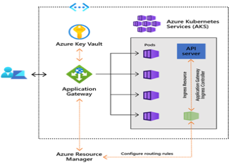

# Application Gateway Ingress Controller

The Application Gateway Ingress Controller (AGIC) enables exposing applications running within AKS to the Internet by leveraging Azure&#39;s native Application Gateway L7 load-balancer. AGIC monitors the Kubernetes cluster on which it is hosted and continuously updates an Application Gateway so that selected services are exposed to the Internet. The most notable features are

- URL routing
- Cookie-based affinity
- Secure Sockets Layer (SSL) termination
- End-to-end SSL
- Support for public, private, and hybrid web sites
- Integrated web application firewall

The App Gateway Ingress Controller architecture looks as follows. The Ingress Resource as defined in a YAML file specifies routing rules. The App Gateway Ingress Controller runs as a pod that takes the ingress resource and configures the Azure App Gateway so that ingress traffic can go to the appropriate application and pods. The AGIC needs to have the appropriate permission to configure the App Gateway.

The Application Gateway Ingress Controller can achieve up to 50 percent lower network latency than in-cluster ingress controllers. App Gateway can be shared with other Azure resources such as a VM and/or Azure App Service. Therefore, making it more cost effective as it is being shared.