- [Prerequisites:](#prerequisites)
  - [Register required resources in the subscription](#register-required-resources-in-the-subscription)

# Prerequisites:

1. An [Azure](https://azure.microsoft.com/en-us/) account with a [subscription](https://theithollow.com/2016/07/11/azure-subscriptions/)
2. [Azure CLI](https://docs.microsoft.com/en-us/cli/azure/install-azure-cli?view=azure-cli-latest) installed and configured
3. Kubernetes command-line tool [kubectl](https://kubernetes.io/docs/tasks/tools/install-kubectl/) installed
4. Lastly, make sure the Azure subscription you use has the following required resources: Storage, Compute, Networking, and ContainerService

## Register required resources in the subscription

Go to the subscription page by clicking on the &quot;All services&quot; link (1) in the top-left panel, then click on the &quot;Subscriptions&quot; link (2). You can see the steps indicated in the screenshot below.

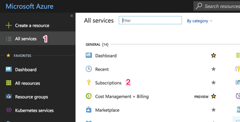

Select the subscription to to create the AKS cluster.

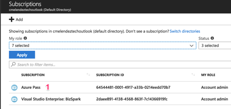

Scroll down and click on the &quot;Resource providers&quot; link to register or review the resources needed.

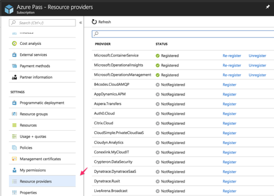

Search (1) for the resources listed before: Storage, Compute, Networking, and ContainerService. If it&#39;s not registered, click on the &quot;Register&quot; (2) link and wait.

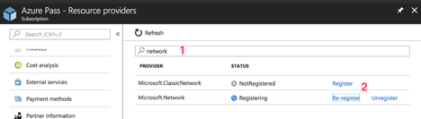

There are two methods that can be followed, which are given below:

Method 1: Creating an AKS/Azure Container Service cluster using the Azure Portal
It is recommended to check the official AKS documents before proceeding further.
Create a new Azure resource
Go to your Azure portal and in the top-left panel, click the “Create a resource” (1) button. Then select “Containers” (2) and click on the “Kubernetes Service” (3) link.

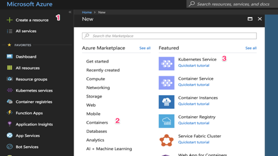

Fill In the Basics configuration:

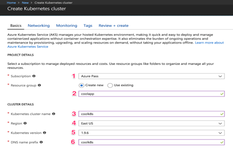

Choose your subscription and use an existing resource group, but for our use let us just create a new one. A resource group is a way for Azure to keep all the related resources together so that you can make templates, share permissions and policies, or clean out everything by simply deleting the resource group. So choose “Create new” and name it—I put “coolapp” (2).

Choose a name for the cluster. I went with “coolk8s” (3). Choose a region where the cluster should be created (4). Ideally, it should be one that’s physically near your users (so if your users are based in the US, you want to create your virtual machine in a US region).

Select the latest version of Kubernetes (5) cluster. Then, write a DNS name (6) to identify your cluster—this should be unique for all the Azure users, so if you’re getting an error, it could be because someone else has already chosen the name you are trying to use. Go to the “Authentication” tab to see this:

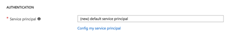

Azure has made the service principal integration simpler—in case you&#39;re just starting out, you can leave this option on default. A [service principal](https://docs.microsoft.com/en-us/azure/active-directory/develop/active-directory-application-objects) is needed so that AKS can interact securely with Azure to create resources like load balancers. Kubernetes&#39; services will sometimes need to be configured as load balancers, so AKS will create a real load balancer from Azure. In case you want to have more control and reuse a service principal, you can [create your own, too](https://docs.microsoft.com/en-us/azure/aks/kubernetes-service-principal).

Now it&#39;s time to select which type of instance the cluster will use. You might see an error screen like this:

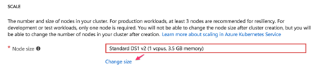

If you are having an &quot;error,&quot; I can tell you it happened to me, too. Don&#39;t worry, it doesn&#39;t necessarily mean that you&#39; are doing something wrong, it can also be because g—it might just be because your subscription has some limitations. The reason can be It could also mean that you&#39; have reached the instances limit or that creating the cluster will put you over the limit. All you need to do is to get rid of the error message is click on the &quot;Change size&quot; link and choose a different instance type.

Node Size:

When I was creating my cluster, I was having problems and I didn&#39;t know why. Azure support guys are amazing, seriously—DM them and they will help you. Otherwise, you can post your question on Stack Overflow and the community there will help you. I was having problems While creating the cluster, because if I was using a small instance for AKS, then it can cause an error. According to the support guys, yIn this scenario ouone would be required need to select an instance with at least 3.5 GB of memory. If not, otherwise the cluster would not be created.n&#39;t come up Tand you&#39;ll see weird errors.

Even if you don&#39;t have this error, let&#39;s change the size so that you don&#39;t spend too much on this test. heThe givenfollowing screen should be followed for helpshould appear:

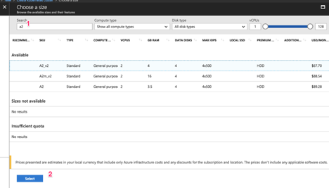

Type &quot;a2&quot; (1) so that the &quot; **Standard A2\_v2″**  instance type appears and click it. Next, click on the blue &quot;Select&quot; (2) button. It will take you back to the previous screen.

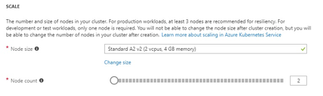

Set &quot;Node count&quot; option to 2. Once done, click on the &quot;Next: Networking&quot; button.

3. Fill in the networking configuration

Networking is one of the most important things to configure when you start integrating services, or if you want to create a VPN tunnel. This is the part where where you need to avoid any networking conflict to access the Kubernetes nodes that AKS configures. Click on the &quot;Networking&quot; tab.You should now beable to view the below seeing thismentioned screen:

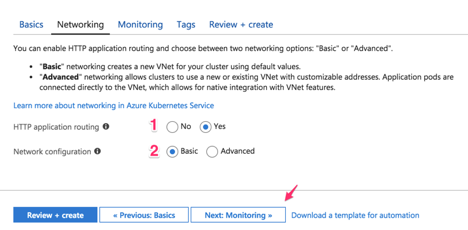

You can leave this section as default and continue with those settings., but let me explain a few things iIn case you want to do something specific with networking, then follow the given steps:.

Start with the HTTP application routing (1). When you create a Kubernetes &quot;LoadBalancer&quot; service type, a public IP address is assigned to you. At some point, you may encounter a few issues might have problems whenwhile creating a new service because you&#39;ve reached an Azure [limit](https://docs.microsoft.com/en-us/azure/azure-subscription-service-limits). Kubernetes has &quot;a collection of rules that allow inbound connections to reach the cluster services&quot; called Ingress, as indicated in the [official docs](https://kubernetes.io/docs/concepts/services-networking/ingress/). Ingress will allow you to have SSL termination and DNS endpoints for your services.

If you want to dive deeper into the subject, you can [check out this post](https://pascalnaber.wordpress.com/2017/10/27/configure-ingress-on-kubernetes-using-azure-container-service/).

For networking configuration (2), choose &quot;Basic&quot; for now and let Azure configure the networking for you. This is where you can&#39;ll define network ranges to allocate IPs—usually known as [CIDR](https://en.wikipedia.org/wiki/Classless_Inter-Domain_Routing). This section is crucial for avoiding network conflicts with your on-prem network or other network resources in Azure. Click on the &quot;Next: Monitoring&quot; button to continue.

4. Fill in the monitoring configuration

There&#39;s not a lot for me to say in this section other than, &quot;This is freaking awesome!&quot;

By default, AKS will give you metrics about the performance of the cluster, and if you choose (which I highly recommend you do!), you can get performance metrics for containers. You may access all the can also get logs to troubleshoot. These monitoring features are invaluable extremely useful when you are integratinge [APM](https://stackify.com/avoid-apm-vanity-metrics/) into your application.

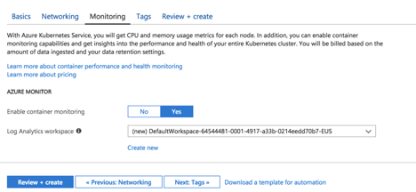

Finally, cIf you&#39;d like to get an idea of what your monitoring results might look like, take a look at this document. Let&#39;s not worry about the tags section for now, so click on the blue &quot;Review + create&quot; button to continue.

5. Review and create

We&#39;re almost there!

Azure will start creating the service principal and will validate the information you have entered. , so the following screen should appear:The image given below may be used for reference:

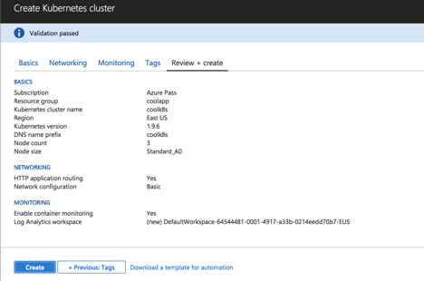

Click on the blue &quot;Create&quot; button to create the cluster. Now&#39;s the time to pause and refill your cup with fresh coffee. It will take a little time for Azure to finish creating the cluster—mine took twenty minutes.

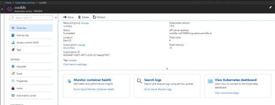

Congratulations! You&#39;ve created a Kubernetes-managed cluster is created in Azure.

Method 2: Creating an Azure Container Service cluster using the command line

The UI has been changing throughout is changing all the time, but the command line has stayed pretty is constant. I find it valuable to use tThe GUI because it gives me us a chance to understand visually how to create the cluster. On the other hand, using the CLI will helps you to automate theis process or use tools like [Terraform](https://stackify.com/setup-an-elasticsearch-cluster-on-azure-w-terraform/)Terraform.

Before we start creating the cluster using the command line e, make sure you have all of the prerequisites that I described above. Also, if you created a cluster using the portal from the previous steps, make sure you delete it or change the names of the resources in the commands you have used earlier.run.

1. Create a new resource group

As I said before, aA resource group is a way for Azure to keep all related resources together so that you can make templates, share permissions and policies, or clean out everything by simply deleting the resource group. So run the following command to create it:

`az group create --name coolapp --location eastus`

2. Create the AKS cluster

Run the following command to create the cluster:

`az aks create --resource-group coolapp --name coolk8s --node-count 2--node-vm-size Standard_A2_v2--generate-ssh-keys`

So what exactly did we just do? Let&#39;s explore the parameters and values we entered here:The parameters used are explained below:

- – **resource-group**  is the name of the resource group we just created.
- – **name**  is the name of the cluster to identify it.
- – **node-count**  is the number of nodes we want for our cluster.
- – **node-vm-size**  is the name of the instance type we choose. It&#39;s better to be specific here to avoid potential problems with the limitations of our subscription.
- – **generate-ssh-keys**  will generate SSH keys on your local machine so it&#39;s easier for you to connect to any node if need be.

Specifying only those arguments means that Azure will use the default values for things like networking or monitoring that we saw when creating the cluster in the portal. . Let&#39;s keep it simple for now, but in case you want to explore the other arguments, you can take a look at the [docs](https://docs.microsoft.com/en-us/cli/azure/aks?view=azure-cli-latest#az-aks-create).

Finally In the meantime, Azure will create the cluster.. Mine took twenty minutes or so to finish. And that&#39;s it! You created the cluster with just two commands. Now let&#39;s make sure the cluster is actually working.

Accessing the Kubernetes UI locally

Whether you created the cluster using the portal, the command line, or both, the following instructions will are to be followedwork to access the Kubernetes dashboard. It is required This is where you need to have the latest version of [Azure CLI](https://docs.microsoft.com/en-us/cli/azure/install-azure-cli?view=azure-cli-latest) and [kubetcl](https://kubernetes.io/docs/tasks/tools/install-kubectl/) installed and configured.

1. Download cluster credentials

Firstly Start by ddownloading the cluster credentials to your computer by running the below givenis command:

`az aks get-credentials --resource-group=coolapp --name=coolk8s`

Specify the resource group with the  **–resource-group**  parameter and the name of the cluster with the **–name**  parameter. Doing thisThis makes it easy to togglinge between different Kubernetes clusters effortless.that you&#39;ve connected previously (for example, a local version of Kubernetes).

2. Browse the cluster

Run the following command. A new browser tab or window will open with the Kubernetes dashboard automatically.

`az aks browse --resource-group coolapp --name coolk8s`

Wait a few more seconds, and the Kubernetes dashboard will appear:

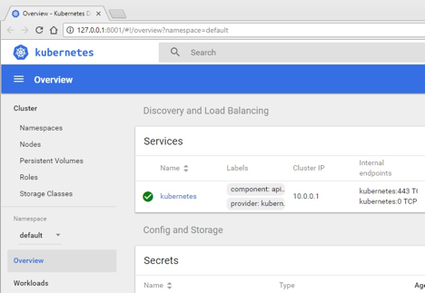

If the your screen appears similar to the one mentioned above, then the cluster is functioninglooks like this one, congratulations! That means your cluster works and you can connect to it with ease.

Clean up your resources

Delete the AKS cluster by running the following command and then confirming the delete :

az aks delete--resource-group coolapp --name coolk8s

It will take some time to finish, but please keep an eye on the results of the command. The cluster might not be deleted, and you&#39;ll end up [paying](https://azure.microsoft.com/en-us/pricing/details/container-service/) until you delete it. If you want to delete the resource group, run the below givenis command:

az group delete -n coolapp