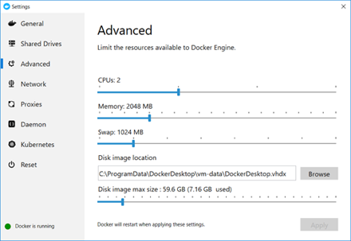
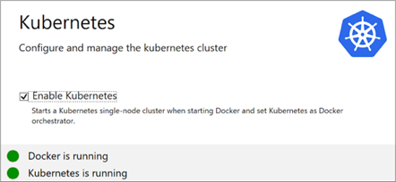
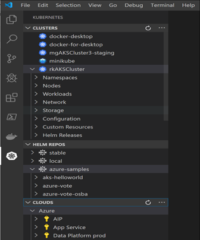
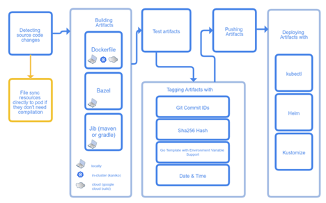
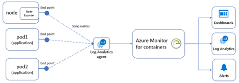

# AKS Resources

- [AKS Resources](#aks-resources)
  - [**Visual Studio Code**](#visual-studio-code)
  - [**Docker for Windows**](#docker-for-windows)
  - [Minikube](#minikube)
  - [**Command Line Interface (CLI)**](#command-line-interface-cli)
    - [Docker](#docker)
    - [Docker Compose](#docker-compose)
    - [Minikube](#minikube-1)
    - [Kubectl](#kubectl)
    - [Helm](#helm)
    - [Git](#git)
    - [Azure CLI](#azure-cli)
    - [**VS Code Extension** : **Azure Resource Manager Tools**](#vs-code-extension--azure-resource-manager-tools)
    - [**VS Code Extension** : Kubernetes](#vs-code-extension--kubernetes)
    - [Skaffold](#skaffold)
    - [Istio as a service mesh](#istio-as-a-service-mesh)
    - [Prometheus for monitoring](#prometheus-for-monitoring)

    - [Skaffold](#skaffold)
    - [Istio as a service mesh](#istio-as-a-service-mesh)
    - [Prometheus for monitoring](#prometheus-for-monitoring)

Machine operating system is Windows 10

## [**Visual Studio Code**](https://code.visualstudio.com/docs)

Lightweight but powerful source code editor. Free.
[https://code.visualstudio.com/download](https://code.visualstudio.com/download)

This tool as it is very light weight and very popular in the general developer community and not just with Microsoft-centric communities and its plugin extensions. Alternative IDEs, are any code editor you choose, including the latest version [Visual Studio](https://visualstudio.microsoft.com/) which has more rich capabilities.

## [**Docker for Windows**](https://docs.docker.com/docker-for-windows/)

Docker is a full development platform to build, run, and share containerized applications. Docker Desktop is the best way to get started with Docker on a Windows machine.



Docker Desktop has Kubernetes [integrated](https://www.docker.com/blog/docker-windows-desktop-now-kubernetes/). So you have a simple local Kubernetes cluster.



Using docker for windows is a main starting point for a developer to build and test containerized applications in your local machine.

## [Minikube](https://github.com/kubernetes/minikube)

Minikube implements a local Kubernetes cluster on macOS, Linux, and Windows. minikube&#39;s primary goals are to be the best tool for local Kubernetes application development and to support all Kubernetes features that fit.

This is another option to Docker Desktop&#39;s OOTB Kubernetes cluster. I found this initially tricky to install and setup, especially with the hyper-v virtual switch on my windows 10 machine. This is solely for local development scenarios and not production. I tried this setup on an Azure VM and I don&#39;t think it is supported well, so don&#39;t bother trying.

## **Command Line Interface (CLI)**

CLIs are text-based interfaces to execute commands against an application or system.

### [Docker](https://docs.docker.com/engine/reference/commandline/cli/)

This is installed as part of Docker for Windows. Here is a [Docker cheat sheet](https://www.docker.com/sites/default/files/d8/2019-09/docker-cheat-sheet.pdf)

Example commands

Build an image from the Docker file in the current directory
`docker build -t helloworldimage:1.0`

Run a container from the image
`docker container run –name myApp -p 5000:80 helloworldimage:1.0`

### [Docker Compose](https://docs.docker.com/compose/)

Compose is a tool for defining and running multi-container Docker applications. With Compose, you use a YAML file to configure your application&#39;s services. I typically use this for testing the app locally and is optional as part of the Kubernetes app lifecycle.

Compose has commands for managing the whole lifecycle of your application:

- Start, stop, and rebuild services
- View the status of running services
- Stream the log output of running services
- Run a one-off command on a service

Example command:

Starts and runs your multi-container app based on the yaml file in the current directory
`docker-compose up`

### [Minikube](https://minikube.sigs.k8s.io/docs/examples/)

Minikube has its own CLI.

Example commands:

Start a cluster
`minikube start`

Access the Kubernetes Dashboard running within the minikube cluster
`minikube dashboard`

minikube makes it easy to open this exposed endpoint in your browser
`minikube service hello-minikube`

### [Kubectl](https://kubernetes.io/docs/tasks/tools/install-kubectl/#install-kubectl-on-windows)

Helps manage and configure a kubernetes cluster, including Azure Kubernetes Service (AKS).

For the commands cheat sheet read [https://kubernetes.io/docs/reference/kubectl/cheatsheet/](https://kubernetes.io/docs/reference/kubectl/cheatsheet/)

Example commands:

List all services in the namespace
`kubectl get services`

Show pods
`kubectl get pods`

Create a Kubernetes resource
`kubectl apply -f ./my-manifest.yaml`

Knowing kubectl is core to being a kubernetes developer or engineer.

### [Helm](https://helm.sh/)

Helm helps you manage Kubernetes applications — Helm Charts help you define, install, and upgrade even the most complex Kubernetes application. Helm is a tool for managing Charts. Charts are packages of pre-configured Kubernetes resources.


Use Helm to:

- Find and use popular software packaged as Helm Charts to run in Kubernetes
- Share your own applications as Helm Charts
- Create reproducible builds of your Kubernetes applications
- Intelligently manage your Kubernetes manifest files
- Manage releases of Helm packages

Helm is integral in packaging up your applications for deployment. It is fairly easy to work with, but have to understand its syntax and really useful to deploy applications freely available. A good example would be the nginx controller when setting up a kubernetes cluster.

### [Git](https://git-scm.com/)

For source control management. This is a standard tool these days.

### [Azure CLI](https://docs.microsoft.com/en-us/cli/azure/get-started-with-azure-cli?view=azure-cli-latest)

Designed to get you working quickly and efficiently with Azure services, with an emphasis on automation.

For managing Azure Kubernetes, most examples lean towards Azure CLI vs Azure PowerShell. They both work well.

You can find the azure aks related commands at [https://docs.microsoft.com/en-us/cli/azure/aks?view=azure-cli-latest](https://docs.microsoft.com/en-us/cli/azure/aks?view=azure-cli-latest)

Example command

Creating an AKS cluster

```
az aks create -g MyResourceGroup -n MyManagedCluster –kubernetes-version 1.13.9 –vm-set-type AvailabilitySet
```

[ARM Templates](https://docs.microsoft.com/en-us/azure/azure-resource-manager/templates/overview)

To implement infrastructure as code for your Azure solutions, use Azure Resource Manager templates. The template is a JavaScript Object Notation (JSON) file that defines the infrastructure and configuration for your project. This is typically when you built your AKS cluster manually and have a good idea on the settings and relationships with other azure resources such as ACR, virtual networks and load balancers, that you want to build ARM templates to have an automated and repeatable deployment across dev, test and production environments.

You can find sample ARM templates related to AKS at [https://github.com/Azure/azure-quickstart-templates/tree/master/101-aks](https://github.com/Azure/azure-quickstart-templates/tree/master/101-aks). You can find other AKS related samples in this repo. At first it is a learning curve to get going and understand the syntax and how it all works. In my experiences it works well.

### **VS Code Extension** : [**Azure Resource Manager Tools**](https://marketplace.visualstudio.com/items?itemName=msazurermtools.azurerm-vscode-tools)

Provides language support for Azure Resource Manager deployment templates and template language expressions. This is used to provide a better developer experience in VS Code when building out ARM Templates for AKS and its dependent azure resources such as virtual networks.

### **VS Code Extension** : [Kubernetes](https://marketplace.visualstudio.com/items?itemName=ms-kubernetes-tools.vscode-kubernetes-tools)

The extension for developers building applications to run in Kubernetes clusters and for DevOps staff troubleshooting Kubernetes applications.



Works with any Kubernetes anywhere (Azure, Minikube, AWS, GCP and more!).

### [Skaffold](https://skaffold.dev/)

Skaffold handles the workflow for building, pushing and deploying your application, allowing you to focus on what matters most: writing code.



This tool is more for the app developer in a dev environment. A scenario that is cool is when a developer makes a change in the code, scaffold will build an image and can deploy the helm chart into your development Kubernetes environment. It basically streamlines the process from code to running app in Kubernetes. It is a mini CI/CD pipeline, although it an integrate into a rigorous CI/CD pipeline tool such as Azure DevOps Pipelines.

### [Istio](https://istio.io/docs/concepts/what-is-istio/) as a service mesh

Istio helps reduce the complexity of these deployments, and eases the strain on your development teams. It is a completely open source service mesh that layers transparently onto existing distributed applications. It is also a platform, including APIs that let it integrate into any logging platform, or telemetry or policy system.

### [Prometheus](https://prometheus.io/docs/introduction/overview/) for monitoring

Prometheus is a popular open source monitoring and alerting toolkit. Prometheus can integrate with [Azure Monitor for containers](https://azure.microsoft.com/en-ca/blog/azure-monitor-for-containers-with-prometheus-now-in-preview/).



Typically, to use Prometheus you need to setup and manage a Prometheus server with a database. With the Azure Monitor integration, no Prometheus server is needed.